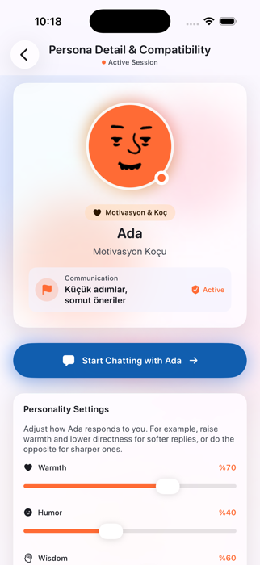
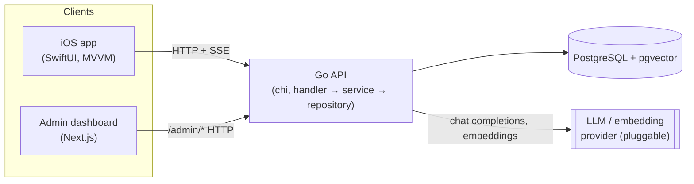

<p align="center">
  
</p>

<h1 align="center">Perchly</h1>

<p align="center">
  A platonic AI companion app — pick a persona, keep one ongoing streamed
  conversation with it, and watch it actually remember you.
</p>

<p align="center">
  <a href="https://github.com/SeniorTurkmen/Perchly/actions/workflows/ci.yml"></a>
  
  
  
  
</p>

---

Perchly is a platonic AI companion app: a Go backend and a SwiftUI iOS
client that let a user pick a persona and have an ongoing, streamed
chat with it — with onboarding-driven personalization, age-appropriate
persona gating, and iMessage-style emoji reactions on either side of
the conversation.

## Screenshots

<p align="center">
  
</p>

<p align="center"><sub>Persona detail & compatibility — pick a companion, tune how it talks to you, and jump straight into chat.</sub></p>

> More screens are on the way — drop additional PNGs into
> `docs/screenshots/` and reference them here as the UI fills out
> (onboarding, chat with streaming + reactions, the admin dashboard).

## Repository layout

```
backend/   Go API (chi, PostgreSQL + pgvector)
ios/       SwiftUI iOS app (MVVM, Liquid Glass design language)
admin/     Internal admin/ops + engineering dashboard (Next.js, shadcn/ui)
```

Each part is independently runnable; the iOS app talks to the backend
over plain HTTP + Server-Sent Events, and the admin dashboard talks to
the backend's separate `/admin/*` API — nothing shared beyond the wire
protocol.



## Features

- 🔓 **Auth** — anonymous sessions from first launch (no signup wall),
  upgradable in place to an email-linked account via a 6-digit OTP
  code. JWT access tokens + rotating opaque refresh tokens.
- 🎭 **Personas** — a fixed set of AI companions (e.g. a motivational
  coach, a daily companion, a hobby/book-club partner), each with its
  own system prompt, tone, and accent color — and now translated
  content across 8 locales.
- 💬 **Chat** — one persistent conversation per user/persona pair.
  Replies stream back over SSE, token by token. Context sent to the
  LLM combines the persona's system prompt, a rolling summary of the
  conversation, the most relevant past messages (via pgvector
  similarity search over message embeddings), and the recent raw
  message window.
- ❤️ **Emoji reactions** — either side of a conversation can leave a
  single emoji reaction on the other's message, iMessage-tapback
  style (❤️ 😂 👍 👎 ‼️ ❓). The user does this via a long-press
  picker in the chat UI; the persona does it by leading its streamed
  reply with a `[[REACT:<emoji>]]` tag the backend parses out before
  the text ever reaches the client.
- 🧭 **Onboarding** — a short, skippable data-collection flow (age range,
  mood preference, notification permission, persona pick) that
  personalizes which persona is suggested first and gates
  not-minor-appropriate personas from users who report being under 18.
  Collected even for anonymous users and never lost if the account is
  later linked.
- 🌍 **i18n / l10n** — locale-aware persona content and transactional
  email, resolved from `Accept-Language`, with Turkish always as the
  zero-duplication fallback.
- 📊 **Quotas & credits** — a free daily message allowance per user, with
  a credit system for going beyond it.

## Backend

Go, [chi](https://github.com/go-chi/chi) router,
[pgx](https://github.com/jackc/pgx) against PostgreSQL with the
[pgvector](https://github.com/pgvector/pgvector) extension,
[golang-migrate](https://github.com/golang-migrate/migrate) for
schema migrations. Layered as
`handler → service → repository → model`.

```bash
cd backend
cp .env.example .env   # fill in an LLM provider key at minimum
make dev               # boots colima+Docker, starts Postgres/pgvector,
                        # runs migrations, starts the API on :8080
```

See `backend/.env.example` for every configuration variable (LLM/embedding
provider selection, JWT secret, SMTP for verification emails, quota
limits, request-log redaction) and `backend/README.md` for details on
Gmail App Passwords and request logging.

Run the test suite with `go test ./...` from `backend/`.

## iOS

SwiftUI, MVVM, the "Liquid Glass" design language (`.glassEffect()`),
project structure generated from `ios/project.yml` via
[XcodeGen](https://github.com/yonaskolb/XcodeGen).

```bash
cd ios
xcodegen generate
open Perchly.xcodeproj
```

Point the app at a locally running backend (default `localhost:8080`)
and run the `Perchly` scheme on a simulator. `PerchlyTests` covers unit
and integration-style tests against a running backend; `PerchlyUITests`
covers end-to-end flows (auth, onboarding, reactions) via XCUITest.

## Admin dashboard

Next.js (App Router, TypeScript, Tailwind, shadcn/ui) — internal tool
for operating the app (users, personas, quotas/credits, conversation
moderation, request logs) and tracking engineering work. Not part of
the public product; talks to the backend's separate `/admin/*` API,
entirely server-side.

```bash
./scripts/dev-admin.sh   # backend infra + API on :8080, dashboard on :3000
```

Boots colima/Postgres, applies migrations, prompts to create an admin
account the first time (or set `ADMIN_EMAIL`/`ADMIN_PASSWORD`), then
runs both servers until Ctrl+C. Safe to re-run — every step is
idempotent. See `admin/README.md` for the auth model and current build
status.

## CI

[`.github/workflows/ci.yml`](.github/workflows/ci.yml) runs on every
push and PR to `main`, in three independent jobs:

| Job       | What it does                                                                 |
| --------- | ----------------------------------------------------------------------------- |
| `backend` | `go vet`, `go build`, migrates a real Postgres+pgvector service container, `go test ./...` (LLM/embedding providers stubbed via the built-in `echo` provider — no API keys needed) |
| `admin`   | `npm ci`, `next lint`, `next build`                                          |
| `ios`     | `xcodegen generate`, `xcodebuild build-for-testing` for the iOS Simulator, unsigned |

## Contributing

There isn't a fixed process yet — this is a young, single-repo
project. Open a PR or just ask.
